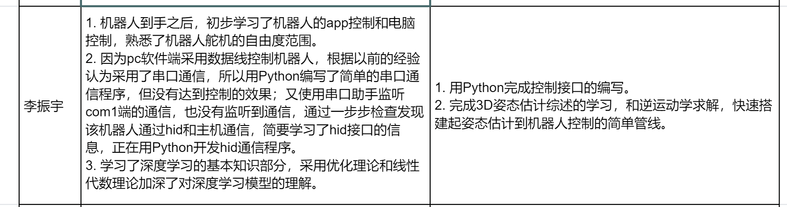

## 10.8

## 10.15

1. 使用usb抓包工具，得到控制机器人的完整指令，然后利用过有线的hid通信，实现了python直接控制机器人的需求。能够在自己编写的函数中输入舵机ID、角度来直接控制机器人，现在正在将实现的功能封装成类；
2. 对于3D姿态估计有了更完整的认识，对其中的弱监督、遮挡状态等问题有了更多了解，了解到其中涉及的一些方法，比如运动条件先验，相机参数先验等；

下周目标：

1. 深入学习3D姿态估计现在面临的一两个关键问题，如弱监督等，学习里面最新的顶会论文，把握该方向的细节；
2. 对于其中创新性较高的论文，仔细阅读。
